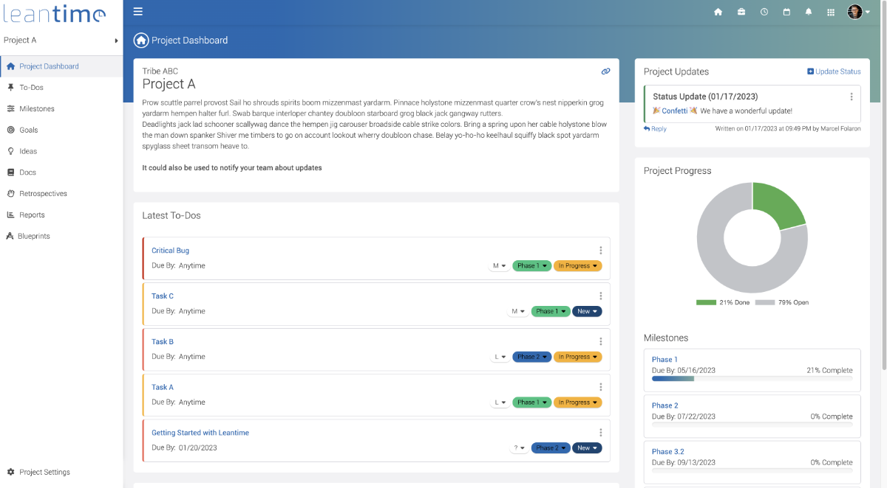

<!--
N.B.: This README was automatically generated by https://github.com/YunoHost/apps/tree/master/tools/README-generator
It shall NOT be edited by hand.
-->

# Leantime for YunoHost

[](https://dash.yunohost.org/appci/app/leantime)  

[](https://install-app.yunohost.org/?app=leantime)

*[Lire ce readme en français.](./README_fr.md)*

> *This package allows you to install Leantime quickly and simply on a YunoHost server.
If you don't have YunoHost, please consult [the guide](https://yunohost.org/#/install) to learn how to install it.*

## Overview

Leantime is a lean open source project management system for startups and innovators. It's an alternative to ClickUp, Notion, and Asana.

**Shipped version:** 2.3.25~ynh1

## Screenshots



## Documentation and resources

* Official app website: <https://leantime.io/>
* Official admin documentation: <https://docs.leantime.io>
* Upstream app code repository: <https://github.com/Leantime/leantime>
* YunoHost documentation for this app: <https://yunohost.org/app_leantime>
* Report a bug: <https://github.com/YunoHost-Apps/leantime_ynh/issues>

## Developer info

Please send your pull request to the [testing branch](https://github.com/YunoHost-Apps/leantime_ynh/tree/testing).

To try the testing branch, please proceed like that.

``` bash
sudo yunohost app install https://github.com/YunoHost-Apps/leantime_ynh/tree/testing --debug
or
sudo yunohost app upgrade leantime -u https://github.com/YunoHost-Apps/leantime_ynh/tree/testing --debug
```

**More info regarding app packaging:** <https://yunohost.org/packaging_apps>
