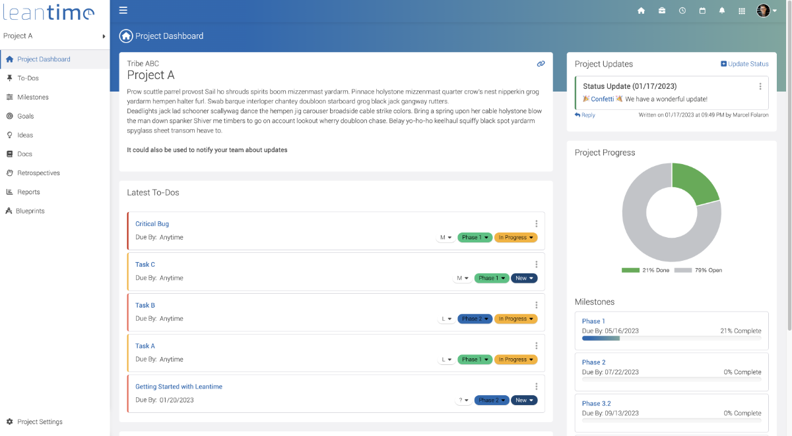

<!--
To README zostało automatycznie wygenerowane przez <https://github.com/YunoHost/apps/tree/master/tools/readme_generator>
Nie powinno być ono edytowane ręcznie.
-->

# Leantime dla YunoHost

[](https://ci-apps.yunohost.org/ci/apps/leantime/)


[](https://install-app.yunohost.org/?app=leantime)

*[Przeczytaj plik README w innym języku.](./ALL_README.md)*

> *Ta aplikacja pozwala na szybką i prostą instalację Leantime na serwerze YunoHost.*  
> *Jeżeli nie masz YunoHost zapoznaj się z [poradnikiem](https://yunohost.org/install) instalacji.*

## Przegląd

Leantime is a lean open source project management system for startups and innovators. It's an alternative to ClickUp, Notion, and Asana.

**Dostarczona wersja:** 3.4.0~ynh1

## Zrzuty ekranu



## Dokumentacja i zasoby

- Oficjalna strona aplikacji: <https://leantime.io/>
- Oficjalna dokumentacja dla administratora: <https://docs.leantime.io>
- Repozytorium z kodem źródłowym: <https://github.com/Leantime/leantime>
- Sklep YunoHost: <https://apps.yunohost.org/app/leantime>
- Zgłaszanie błędów: <https://github.com/YunoHost-Apps/leantime_ynh/issues>

## Informacje od twórców

Wyślij swój pull request do [gałęzi `testing`](https://github.com/YunoHost-Apps/leantime_ynh/tree/testing).

Aby wypróbować gałąź `testing` postępuj zgodnie z instrukcjami:

```bash
sudo yunohost app install https://github.com/YunoHost-Apps/leantime_ynh/tree/testing --debug
lub
sudo yunohost app upgrade leantime -u https://github.com/YunoHost-Apps/leantime_ynh/tree/testing --debug
```

**Więcej informacji o tworzeniu paczek aplikacji:** <https://yunohost.org/packaging_apps>
